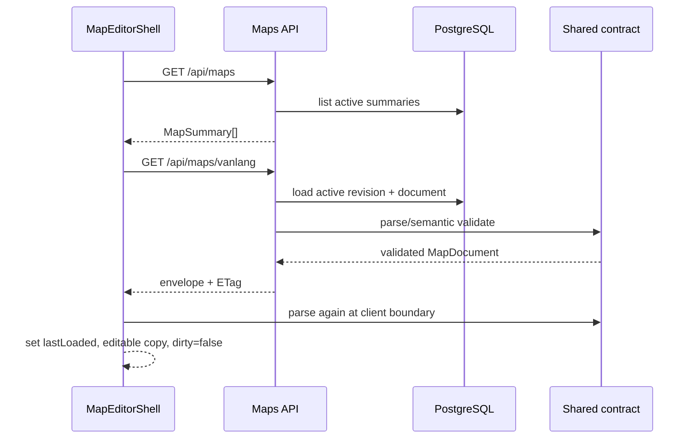
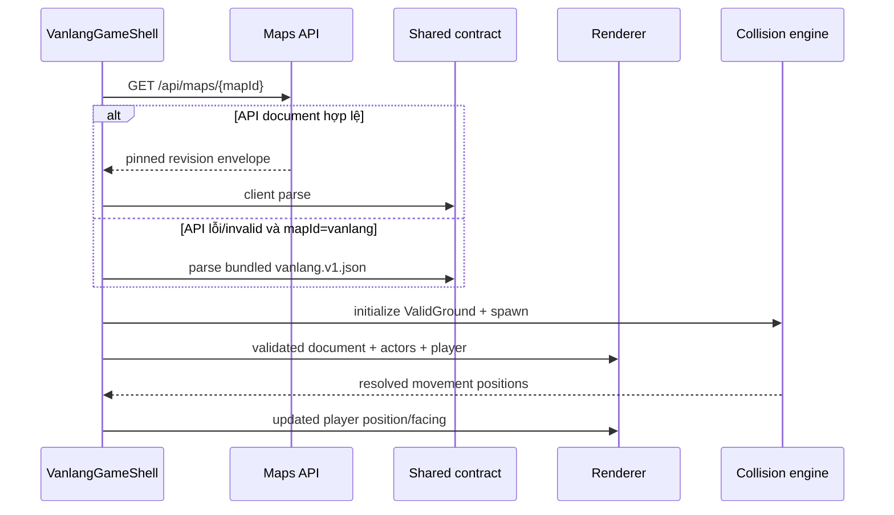

# Đặc tả Map Editor Mode

Trạng thái: **DRAFT FOR APPROVAL**  
Phạm vi: phiên PLAN, không triển khai code sản phẩm  
Map nền tảng: `vanlang`  
Schema document đầu tiên: `1`

## 1. Mục tiêu và quyết định đã khóa

Map Editor Mode cho phép chọn một map hiện hữu theo `mapId`, chỉnh metadata, nền, object 2D/3D, vùng đi được và collider, sau đó lưu một revision mới và kích hoạt revision đó bằng một transaction. Runtime chỉ nhận `MapDocument` đã được validate; renderer và collision engine không tự fetch dữ liệu và không chứa dữ liệu riêng cho Văn Lang.

Các quyết định V0:

1. `mapId` là định danh ổn định, dạng slug chữ thường (`^[a-z0-9]+(?:-[a-z0-9]+)*$`), không đổi khi sửa tên hiển thị.
2. Mỗi lần Save tạo một revision bất biến mới và đồng thời chuyển con trỏ active sang revision mới trong cùng transaction. V0 không có draft riêng, publish riêng hoặc autosave.
3. API đọc map active là public như dữ liệu game hiện tại. API ghi chỉ được bật trong môi trường local/internal bằng feature flag; production write bị từ chối cho đến khi có xác thực admin phía server.
4. Runtime pin revision lúc vào dungeon. Một lần Save không hot-swap map của phiên chơi đang mở; lần load/enter tiếp theo mới nhận revision active mới.
5. Navigation dùng mặt phẳng map-local `X/Z` theo world units. Ảnh và object 2D dùng tọa độ chuẩn hóa độc lập.
6. Vùng nền hợp lệ là hợp của mọi walkable polygon đang bật trừ hợp của mọi collider đang active.
7. NPC/quest content vẫn thuộc hệ gameplay hiện hữu. `MapDocument` chỉ sở hữu vị trí/anchor runtime thông qua object binding; editor không sửa nội dung hội thoại, quest hoặc chỉ số NPC.
8. Asset chỉ được tham chiếu bằng path same-origin đã tồn tại. Upload asset không thuộc V0.

## 2. Bằng chứng hiện trạng repository

- `frontend/src/app/_components/vanlang-game-shell.tsx:34-67` giữ `selectedMap`, `playerPos` và các hằng movement trong state/localStorage; `:235-257` xoay input sang tọa độ X/Z rồi gọi `projectToNavmesh`; `:352-362` luôn vào map `vanlang`; `:554-584` truyền state vào dungeon screen.
- `frontend/src/app/_components/vanlang-navmesh.ts:4-42` hard-code một plaza, ba route và triangulation; `:66-85` chỉ chiếu điểm về tam giác/biên gần nhất; `:87-89` đổi tọa độ NPC bằng offset cố định `3.5`.
- `frontend/src/app/_components/vanlang-dungeon-screen.tsx:136-148` hard-code ảnh `/vanlang-rebirth-arena.png` và mount renderer 3D; `:178-186` chuyển nút cảm ứng thành vector movement.
- `frontend/src/app/_components/vanlang-dungeon-world.tsx:17-20` hard-code model, ground height và root rotation; `:109-180` đưa `playerPos.x/y` vào Three.js `x/z`; `:183-200` dựng arena, navmesh debug, NPC và player trong cùng scene.
- `frontend/src/app/_components/vanlang-mock-data.ts:15-36`, `:102-171` chứa metadata map và vị trí NPC tĩnh; chưa có document map hoặc asset/object schema dùng chung.
- `frontend/src/app/admin/page.tsx:7-30` chỉ là trang module placeholder; chính trang này ghi tại `:14-15` rằng access control chưa được chốt.
- `backend/src/app.ts:8-22` chỉ đăng ký health, progress và tutor routes; CORS hiện chưa cho `PUT` (`:12-15`). `backend/src/routes/progress.ts:35-64` là mẫu hiện có cho Zod `safeParse`, lỗi 400 và Drizzle upsert.
- `backend/src/server/db/schema.ts:3-34` chỉ có player profile, learning attempt và quest progress; chưa có map table, revision hoặc optimistic concurrency.
- `infra/postgres/init/001_init.sql:1-41` là init/seed duy nhất và được Docker mount vào `/docker-entrypoint-initdb.d`; vì vậy nó chỉ chạy khi volume PostgreSQL được tạo mới. Chưa có migration runner cho database đã tồn tại.
- `tests/e2e/dungeon-rebirth.spec.ts` đã kiểm tra các checkpoint navmesh, movement, reload, mobile controls và WebGL asset fallback; đây là regression suite phải tiếp tục chạy sau khi runtime chuyển sang data-driven.

## 3. Phạm vi chức năng V0

Editor phải làm được:

- liệt kê map hiện có và chọn map bằng `mapId`;
- load revision active kèm ETag/revision;
- chỉnh các field thuộc `MapDocument` được mô tả dưới đây;
- xem preview 2D/3D và overlay navigation/collider;
- thêm/xóa/sắp thứ tự object trong map hiện hữu;
- thêm/xóa/sửa nhiều walkable polygon;
- chọn collider `none`, `circle`, `rectangle` hoặc `polygon` cho object;
- validate local trước Save, hiển thị lỗi theo field/object/polygon;
- Save thủ công với optimistic concurrency; Save thành công phải vừa tạo revision vừa activate;
- reload runtime bằng `mapId` và nhận đúng revision active mới.

Editor V0 không tạo `mapId` mới. Backend Save trả 404 nếu `mapId` chưa tồn tại.

## 4. `MapDocument` contract

### 4.1 Envelope và ownership

Response load dùng envelope server-owned:

| Field | Kiểu | Quy tắc |
|---|---|---|
| `mapId` | string | Trùng `document.mapId` và path parameter. |
| `revision` | integer | Bắt đầu từ 1, tăng đúng 1 mỗi Save thành công. |
| `etag` | string | Giá trị opaque, response header `ETag` phải giống field này. |
| `activatedAt` | ISO timestamp | Do server sinh. |
| `document` | `MapDocument` | Document đã qua structural và semantic validation. |

`revision`, `etag`, `activatedAt`, audit time và checksum không nằm trong `MapDocument`; client không được tự đặt.

### 4.2 Các field cấp cao

| Field | Bắt buộc | Nội dung |
|---|---:|---|
| `schemaVersion` | có | Literal `1`. Version không được tự động nâng khi load. |
| `mapId` | có | Slug ổn định, tối đa 64 ký tự. |
| `metadata` | có | Tên, mô tả, accessibility label và optional thumbnail path. |
| `background` | có | Nền 2D và cách fit. |
| `world` | có | Ground/camera/root transform của scene 3D. |
| `navigation` | có | Spawn, player radius và danh sách walkable polygons. |
| `objects` | có | Mảng union object 2D/3D, có thứ tự render xác định. |

`metadata` gồm:

- `name`: 1-120 ký tự;
- `description`: 0-1.000 ký tự;
- `ariaLabel`: 1-160 ký tự;
- `thumbnailSrc`: optional same-origin asset path.

Không lưu trạng thái `draft/active` trong document; trạng thái active thuộc row database để tránh document và pointer mâu thuẫn.

### 4.3 Background và hệ tọa độ 2D

`background` gồm `src`, `alt`, `fit` (`contain | cover | fill`), `color` và `aspectRatio` dương. `src` phải bắt đầu bằng `/`, không chấp nhận URL ngoài, `data:`, `blob:` hoặc path traversal.

Tọa độ 2D chuẩn hóa:

- origin `(0,0)` là góc trên-trái của canvas map sau khi xác định aspect ratio;
- trục `x` tăng sang phải, trục `y` tăng xuống dưới;
- position, anchor, width và height được lưu theo tỷ lệ canvas, không theo pixel;
- position/anchor phải trong `[0,1]`; size phải lớn hơn `0`; object được phép tràn canvas nếu bounding box sau transform vẫn giao canvas;
- rotation lưu bằng degree, chiều kim đồng hồ; scale dương, `(1,1)` là kích thước gốc;
- resize viewport chỉ thay phép đổi normalized-to-pixel, không thay document.

`Transform2D` gồm `position {x,y}`, `size {width,height}`, `anchor {x,y}`, `rotationDeg`, `scale {x,y}`.

### 4.4 Hệ tọa độ 3D

World dùng hệ tay phải của Three.js, `Y` hướng lên; ground/navigation nằm trên mặt phẳng map-local `X/Z`. Một world unit được coi là một mét logic. Document lưu map-local values trước `world.rootTransform`; renderer áp root transform cho toàn scene, còn collision engine luôn tính trong map-local X/Z.

`world` gồm:

- `groundY`;
- `rootTransform` với position, rotation degree và scale 3D;
- `camera` với `position`, `target`, `fovDeg`, `near`, `far`;
- `ambient` tối thiểu gồm background/lighting preset ID; nội dung preset nằm trong renderer, không phải asset upload.

`Transform3D` gồm `position {x,y,z}`, `rotationDeg {x,y,z}`, fixed Euler order `YXZ`, và `scale {x,y,z}`. Scale phải dương. Runtime chuyển degree sang radian đúng một lần ở renderer boundary.

### 4.5 Object và rendering order

Mọi object có các field chung:

- `id`: slug duy nhất trong document, tối đa 64 ký tự;
- `name`: nhãn editor;
- `kind`: `sprite2d | model3d`;
- `enabled`: false thì không render, không bind entity và collider không active;
- `renderLayer`: `underlay2d | world3d | overlay2d`;
- `renderOrder`: integer từ `-10000` đến `10000`;
- `collider`: union ở mục 5;
- optional `binding`: `{ type: "npc", entityId: string }` để gameplay gắn NPC hiện hữu vào placement; không chứa content NPC.

Ràng buộc theo kind:

- `sprite2d` chỉ dùng `underlay2d` hoặc `overlay2d`; có `src`, `alt`, `transform2d` và optional `navigationTransform` khi collider khác `none`.
- `model3d` chỉ dùng `world3d`; có `src`, `transform3d`, `castShadow`, `receiveShadow`. Collider transform được suy ra từ X/Z, rotation Y và scale X/Z của `transform3d`.
- `sprite2d.navigationTransform` gồm position X/Z, yaw degree và scale X/Z trong world units. Nó là runtime physical pose của sprite; bắt buộc khi sprite có collider. Preview phải hiển thị đồng thời outline visual và physical để không che giấu sai lệch giữa hai hệ tọa độ.
- Một `binding.entityId` chỉ xuất hiện một lần trong document. Runtime entity thay visual placeholder nếu có; collider vẫn thuộc object placement.

Thứ tự render tuyệt đối:

1. `background`;
2. `underlay2d`;
3. `world3d` environment objects;
4. runtime actors/player;
5. `overlay2d`;
6. HUD/dialog.

Trong mỗi layer, sort tăng dần theo `renderOrder`, sau đó theo `id` lexical để kết quả ổn định. Với Three.js, renderer cũng gán `Object3D.renderOrder`; depth test vẫn bật cho object opaque. V0 không cam kết sort đúng cho nhiều model transparent giao cắt nhau; đó là backlog.

Giới hạn V0: tối đa 500 objects/document. Asset lỗi không làm crash screen: object đó hiển thị placeholder trong editor, bị bỏ qua trong runtime và ghi telemetry/console error; background lỗi dùng màu `background.color`.

## 5. Navigation và collision

### 5.1 Walkable polygons

`navigation.walkablePolygons` là mảng từ 1 đến 64 phần tử. Mỗi phần tử có `id`, `enabled` và `points`, trong đó points là từ 3 đến 128 vector `{x,z}` map-local world units.

Semantic validation bắt buộc:

- mọi số hữu hạn và trị tuyệt đối không quá `10.000`;
- polygon có diện tích khác 0, không tự cắt, không có hai point liên tiếp trùng nhau;
- canonicalizer đổi winding về counter-clockwise trước checksum/save;
- polygon được phép rời nhau hoặc overlap; engine phải union, không giả định một navmesh liên thông;
- spawn phải nằm trong vùng hợp lệ sau khi trừ collider và xét player radius.

### 5.2 Collider union

Collider là discriminated union:

- `none`;
- `circle`: local `center {x,z}` và `radius > 0`;
- `rectangle`: local `center {x,z}`, `width > 0`, `depth > 0`, optional local `rotationDeg`;
- `polygon`: local `points` từ 3 đến 64, cùng quy tắc polygon đơn/không suy biến.

Collider khác `none` có `enabled`. Một collider chỉ **active** khi object `enabled === true`, collider `enabled === true`, và object có runtime transform hợp lệ.

Collider luôn lưu local geometry, không lưu sẵn world vertices. Mỗi frame có transform thay đổi, hoặc mỗi lần document load với object tĩnh, engine tạo footprint world theo thứ tự:

1. scale local X/Z theo object runtime scale;
2. rotate theo object yaw cộng local rectangle rotation nếu có;
3. translate theo object runtime position X/Z.

Circle dưới non-uniform scale dùng bán kính bảo thủ `radius × max(abs(scaleX), abs(scaleZ))`; V0 không tạo ellipse. Rectangle trở thành oriented rectangle. Polygon transform từng point. Root transform 3D không tham gia collision vì cả player và geometry đều ở map-local plane.

### 5.3 Vùng hợp lệ và movement

Gọi `W` là union của mọi enabled walkable polygon và `C` là union footprint của mọi active collider. Vùng nền hợp lệ đúng theo yêu cầu là:

`ValidGround = W - C`

Player có `navigation.playerRadius > 0`. Một vị trí center hợp lệ khi toàn bộ circle của player nằm trong `ValidGround`. Tương đương, implementation có thể erosion walkable và expand colliders theo player radius, nhưng kết quả phải giống phép kiểm tra footprint; không được chỉ kiểm tra center point.

Movement runtime:

1. Từ input và delta time, tính desired center trong map-local X/Z.
2. Nếu footprint hợp lệ, nhận desired center.
3. Nếu không hợp lệ, sweep segment từ current tới desired để lấy điểm hợp lệ xa nhất và project phần dư theo tangent nhằm cho phép trượt dọc biên.
4. Nếu sweep bắt đầu từ vị trí invalid, chạy quy tắc recovery ở mục 5.4 trước movement.
5. Collision module trả `{position, collided, reason}`; shell chỉ persist kết quả, không tự sửa geometry.

Boundary được coi là inclusive với epsilon chung `1e-6` world unit. Geometry engine phải deterministic trên cùng document/input.

### 5.4 Obstacle di chuyển đè lên player

Quy tắc này áp dụng cho preview editor và mọi obstacle runtime có transform thay đổi:

1. Áp transform obstacle dạng tentative và tính lại `ValidGround`.
2. Nếu player footprint vẫn hợp lệ, commit transform.
3. Nếu bị overlap, tìm vị trí hợp lệ gần nhất thuộc phần còn lại của connected component cũ. Candidate được tạo từ biên collider và biên walkable sau khi cộng epsilon; chọn khoảng cách Euclid nhỏ nhất, tie-break theo `x` rồi `z` tăng dần.
4. Commit obstacle và đưa player tới candidate trong cùng update tick; không gây damage, không teleport qua component khác và không để player ở trạng thái invalid dù chỉ một frame.
5. Nếu component cũ không còn vị trí hợp lệ, thử `navigation.spawn` nếu spawn hợp lệ.
6. Nếu cả hai đều thất bại, **reject/cancel transform obstacle** trong editor/runtime và trả lỗi `OBSTACLE_TRAPS_PLAYER`. Save cũng bị chặn nếu document có thể làm spawn invalid hoặc `ValidGround` rỗng.

Runtime session không hot-load revision mới, nên Save từ editor không đẩy player của phiên đang mở. Quy tắc trên vẫn phải được unit-test với preview player và obstacle động để collision engine có hành vi xác định.

## 6. Validation contract dùng chung

Tạo workspace package `@van-lang/map-contract` làm nguồn duy nhất cho:

- TypeScript types được suy ra từ Zod schema;
- `MapDocumentSchemaV1`, API DTO schemas và version dispatcher;
- semantic validator cho uniqueness, polygons, spawn, asset path và giới hạn;
- canonical JSON/checksum helper;
- pure collision geometry, không phụ thuộc React, DOM, Three.js, Fastify hoặc database;
- canonical fixture `maps/vanlang.v1.json` dùng cho seed và frontend fallback.

Frontend parse mọi API/fallback document trước khi đưa vào editor/renderer. Backend parse body trước transaction và parse JSONB khi đọc; row active có document invalid phải được coi là lỗi server, không gửi dữ liệu chưa validate xuống runtime.

Structural error dùng Zod issues. Semantic error chuẩn hóa thành:

| Field | Ý nghĩa |
|---|---|
| `code` | Mã ổn định, ví dụ `DUPLICATE_OBJECT_ID`, `SELF_INTERSECTING_POLYGON`, `INVALID_SPAWN`. |
| `path` | JSON path tới field/object/polygon. |
| `message` | Thông báo tiếng Việt cho editor. |
| `objectId` / `polygonId` | Optional định vị canvas. |

Backend là authority cuối. Frontend validation chỉ để feedback sớm, không thay validation server.

Giới hạn request Save: JSON body tối đa 1 MiB; tối đa 500 object, 64 walkable polygon, 128 point/walkable polygon và 64 point/collider polygon. Reject `NaN`, infinity, unknown schema version, unknown keys ở các object contract và asset URL không same-origin.

## 7. API contract

Base URL tiếp tục lấy từ `NEXT_PUBLIC_API_BASE_URL`.

### 7.1 List

`GET /api/maps`

- Public, chỉ trả map có active revision hợp lệ.
- Response: `{ maps: MapSummary[] }`.
- `MapSummary`: `mapId`, `name`, `description`, `thumbnailSrc`, `activeRevision`, `updatedAt`.
- Sort `name` theo locale `vi`, tie-break `mapId`.
- Không trả full JSON document.

### 7.2 Load

`GET /api/maps/:mapId`

- Public, trả active `MapRevisionEnvelope`.
- Header `ETag` bắt buộc; hỗ trợ `If-None-Match` và trả 304.
- 400 cho `mapId` sai format, 404 nếu không có map/active revision, 500 `MAP_DOCUMENT_INVALID` nếu dữ liệu active không qua shared validator.
- Runtime không tự chọn map đầu tiên nếu `mapId` không tồn tại.

### 7.3 Save và activate atomically

`PUT /api/admin/maps/:mapId`

- Body: `{ document: MapDocument }`.
- Header `If-Match` bắt buộc và phải là ETag/revision vừa load.
- Path `mapId`, body `document.mapId` và row map phải giống nhau.
- Thành công trả 200 với envelope của revision mới và ETag mới.
- 400 cho structural/semantic validation, 404 cho map chưa tồn tại, 412 `MAP_REVISION_CONFLICT` nếu revision active đã đổi, 413 nếu quá 1 MiB, 503 `MAP_EDITOR_WRITE_DISABLED` nếu write gate tắt.
- Không retry tự động request Save. Khi 412, editor giữ bản local dirty, load bản server mới và yêu cầu người dùng reload/so sánh; merge UI là LATER.

Write gate V0:

- env backend `MAP_EDITOR_WRITE_ENABLED` mặc định `false`;
- backend từ chối khởi động nếu flag là `true` trong production;
- khi flag tắt, route PUT không thực hiện DB write;
- khi bật local/internal, Origin vẫn phải khớp `FRONTEND_URL`, CORS bổ sung `PUT` và `If-Match`;
- frontend chỉ bật nút Save khi `NEXT_PUBLIC_MAP_EDITOR_WRITE_ENABLED=true` và API load thành công;
- production admin authentication/authorization là follow-up bắt buộc trước khi mở write ngoài local. Origin/CORS không được xem là authentication.

## 8. Atomic save, concurrency và activation

Transaction Save bắt buộc theo thứ tự:

1. Parse body và chạy semantic validation ngoài transaction; canonicalize và tính SHA-256 checksum.
2. Bắt đầu database transaction.
3. Lock row `maps` theo `map_id` (`SELECT ... FOR UPDATE`).
4. So sánh `If-Match` với active revision hiện tại. Mismatch thì rollback và trả 412.
5. Tính revision mới bằng active/highest revision + 1 trong row đã lock.
6. Insert immutable row `map_revisions` chứa canonical document, checksum và audit fields.
7. Update `maps.active_revision_id`, denormalized display fields và `updated_at` sang revision vừa insert.
8. Commit. Chỉ sau commit mới trả ETag/envelope mới.

Không được update JSONB active tại chỗ. Nếu insert revision hoặc update pointer thất bại, transaction rollback và active revision cũ vẫn phục vụ runtime. Hai Save đồng thời với cùng ETag chỉ một request được thành công.

## 9. Database, migration và seed Văn Lang

### 9.1 Tables dự kiến

`maps`:

- `map_id TEXT PRIMARY KEY`;
- `display_name TEXT NOT NULL`;
- `description TEXT NOT NULL DEFAULT ''`;
- `thumbnail_src TEXT`;
- `active_revision_id UUID`;
- `created_at`, `updated_at TIMESTAMPTZ NOT NULL`.

`map_revisions`:

- `id UUID PRIMARY KEY DEFAULT gen_random_uuid()`;
- `map_id TEXT NOT NULL REFERENCES maps(map_id) ON DELETE RESTRICT`;
- `revision INTEGER NOT NULL CHECK (revision > 0)`;
- `schema_version INTEGER NOT NULL`;
- `document JSONB NOT NULL`;
- `checksum TEXT NOT NULL`;
- `created_by TEXT NOT NULL` (`seed`, `local-editor`, hoặc admin subject trong tương lai);
- `created_at TIMESTAMPTZ NOT NULL`;
- unique `(map_id, revision)` và unique `(map_id, id)` để active pointer có thể ràng buộc cùng map.

Sau khi tạo cả hai table, migration thêm composite FK `(map_id, active_revision_id)` từ `maps` tới `(map_id, id)` của `map_revisions`, deferrable trong transaction. `active_revision_id` chỉ nullable trong lúc seed/khôi phục; API list/load bỏ qua row chưa active.

### 9.2 Migration strategy

Hiện tại `infra/postgres/init/001_init.sql` không thể migrate volume cũ. Implementation phải bổ sung một migration runner nhỏ dùng package `pg` đã có, thư mục SQL có thứ tự và table ledger `schema_migrations`; không reset volume và không sửa lịch sử `001_init.sql`.

Quy tắc:

- migration `002_map_documents.sql` tạo ledger/tables/index/FK idempotently và được runner ghi nhận;
- `pnpm --dir backend db:migrate` áp migration còn thiếu trong transaction và fail-fast;
- setup database mới vẫn chạy `001_init.sql`, sau đó runner áp `002`; không dựa vào việc xóa volume;
- rollback production không xóa tables/revisions. Rollback application chỉ quay code; active data còn nguyên. Migration down destructive không thuộc V0;
- backend startup/readiness phải fail rõ nếu schema map chưa được migrate thay vì âm thầm fallback khi API map được bật.

### 9.3 Seed/migrate map `vanlang`

Canonical `packages/map-contract/maps/vanlang.v1.json` phải biểu diễn tương đương hiện trạng:

- `mapId: vanlang`, metadata hiện có;
- background `/vanlang-rebirth-arena.png`, fit `contain`, aspect ratio `16/9`;
- arena model `/models/vanlang-rebirth/arena.runtime.glb`, groundY `0.72`, root Y rotation `135°`, camera hiện hữu;
- spawn `(0,0)`;
- bốn walkable polygons: plaza 12 points và ba route quads lấy từ `vanlang-navmesh.ts`, không lưu triangles đã triangulate;
- bốn placement binding cho NPC hiện hữu, chuyển tọa độ cũ bằng `x - 3.5`, `z = y - 3.5`;
- không thêm obstacle/collider mới ngoài hiện trạng.

`pnpm --dir backend db:seed:maps`:

1. Parse canonical JSON bằng shared schema.
2. Trong transaction, insert `maps('vanlang')` nếu chưa có.
3. Nếu map chưa có revision, insert revision 1 với `created_by='seed'` và activate.
4. Nếu đã có bất kỳ revision nào, không overwrite và báo `skipped`; seed chạy lặp phải idempotent.

Việc chuyển sang data-driven không được làm thay đổi vị trí spawn, đường đi hoặc NPC cảm nhận được so với test hiện tại.

### 9.4 Fallback strategy

- Runtime thử `GET /api/maps/vanlang` khi vào dungeon.
- Với network error, timeout, 5xx, 404 hoặc response invalid, riêng `mapId=vanlang` dùng canonical bundled `vanlang.v1.json` sau khi validate cùng schema.
- Không fallback sang “map đầu tiên”, không fallback cho `mapId` khác và không dùng document invalid.
- Fallback phải hiển thị non-blocking status/telemetry `MAP_FALLBACK_ACTIVE`; gameplay Văn Lang vẫn hoạt động.
- Nếu cả API và bundled fixture đều invalid, không mount renderer/collision; hiển thị error state có nút quay lại Bản đồ Ký Ức.
- Editor không được Save khi đang xem fallback mà chưa load được ETag server; như vậy không thể ghi đè mù.
- Lần deploy rollback dùng active revision cũ bằng thao tác database có kiểm soát hoặc save lại một revision mới từ document cũ; không mutate lịch sử revision.

## 10. Component boundaries

### 10.1 Frontend editor

- `AdminMapEditorPage`: route-level access/gate, không chứa geometry.
- `MapEditorShell`: map selection, server envelope, dirty state, validation results, Save/412 handling.
- `MapInspector`: form metadata/background/object numeric fields.
- `MapViewport`: composition preview; gọi renderer read-only và overlay gizmo, không tự persist.
- `WalkablePolygonEditor` và `ColliderEditor`: chuyển pointer events thành document edits; mọi output đi qua editor state/validation.
- `map-api-client`: list/load/save DTO parsing và ETag; không import React.

V0 có một selection, explicit Save và Reset-to-last-loaded. Không có command history/undo stack.

### 10.2 Runtime renderer

- `VanlangGameShell` sở hữu `mapId`, load state, pinned revision và player state; không sở hữu navmesh constants.
- `VanlangDungeonScreen` chỉ bố trí background/world/HUD và error/loading/fallback state.
- `VanlangDungeonWorld` nhận validated `MapDocument`, render object/world settings; không import mock map data hoặc API client.
- Renderer 2D và 3D chỉ đọc `objects` theo layer/order. Missing asset được xử lý tại renderer boundary.
- Gameplay system resolve `binding.entityId` sang NPC hiện hữu; missing binding target là runtime warning và object placeholder bị bỏ qua, không làm document geometry invalid.

### 10.3 Collision engine

- Pure module trong `@van-lang/map-contract`; input là navigation, objects và player/desired position; output không chứa React/Three types.
- Chịu trách nhiệm union/subtract, transform collider, point/footprint validity, sweep/slide, projection/recovery và deterministic tie-break.
- `vanlang-navmesh.ts` bị thay bằng adapter tạm hoặc xóa sau khi mọi caller/test chuyển sang engine; không giữ song song hai nguồn geometry.

### 10.4 Backend

- `maps` route chỉ làm HTTP parsing/status/header.
- `map repository/service` sở hữu transaction, row lock, revision, checksum và DB-to-contract parsing.
- Shared contract sở hữu validation; Drizzle schema chỉ mô tả storage.
- Không cho editor/frontend truy cập database trực tiếp.

## 11. Sequence bắt buộc

### 11.1 Editor load



### 11.2 Save + activate

```mermaid
sequenceDiagram
  participant E as MapEditorShell
  participant A as Maps API
  participant C as Shared contract
  participant D as PostgreSQL
  E->>C: validate editable document
  E->>A: PUT /api/admin/maps/vanlang + If-Match
  A->>C: validate, canonicalize, checksum
  A->>D: BEGIN; lock maps row
  D-->>A: current active revision
  A->>A: compare If-Match
  A->>D: insert immutable revision N+1
  A->>D: update active pointer and summary
  A->>D: COMMIT
  A-->>E: new envelope + ETag
  E-->>E: lastLoaded=new; dirty=false
```

Nếu ETag mismatch, không insert/update; API rollback và trả 412. Editor giữ editable copy dirty.

### 11.3 Runtime load



## 12. Error/degraded behavior

- API list fail: editor hiển thị retry, không tự tạo list giả.
- Load fail: runtime Văn Lang có bundled fallback; editor không có writable fallback.
- Save timeout sau khi request có thể đã commit: editor phải reload map trước khi retry để biết ETag active; không gửi lại PUT mù.
- Invalid object asset: placeholder/editor warning; save được phép nếu path hợp lệ nhưng file tạm lỗi. Background có color fallback.
- Invalid geometry/spawn/duplicate IDs: chặn Save.
- Database unavailable: read trả 503; runtime fallback Văn Lang, editor read-only/error.
- Active revision corrupt: API trả `MAP_DOCUMENT_INVALID`, log mapId/revision/checksum, không tự activate revision khác. Operator có thể chọn document cũ và save thành revision mới sau khi sửa.

## 13. BLOCK cases cho implementation đầu tiên

Các mục sau làm hỏng happy path, mất dữ liệu hoặc tạo lỗ hổng và phải hoàn tất trước khi coi feature done:

1. **[BLOCK] Write exposure:** PUT phải mặc định tắt, tuyệt đối không bật ở production khi chưa có server-side admin auth.
2. **[BLOCK] Lost update:** `If-Match`, row lock và 412 phải ngăn hai tab overwrite nhau.
3. **[BLOCK] Partial activation:** insert revision và đổi active pointer phải cùng transaction; lỗi giữa chừng giữ revision active cũ.
4. **[BLOCK] Existing database migration:** database volume hiện hữu phải nâng schema không reset/xóa dữ liệu.
5. **[BLOCK] Invalid document:** shared validator phải chặn unknown version, duplicate IDs, polygon tự cắt/suy biến, invalid spawn và empty valid region.
6. **[BLOCK] Runtime fallback:** Văn Lang vẫn load được khi map API không sẵn sàng; fallback cũng phải validate.
7. **[BLOCK] Collision correctness:** union nhiều walkable polygons, trừ collider đã transform và xét player radius.
8. **[BLOCK] Obstacle/player overlap:** áp đúng recovery/reject rule; không được để player kẹt/invalid.
9. **[BLOCK] Save uncertainty:** timeout/5xx không được auto-retry tạo revision trùng; reload trước retry.
10. **[BLOCK] Seed safety:** seed idempotent và không overwrite map đã được editor sửa.
11. **[BLOCK] Regression:** movement, NPC proximity, rebirth flow và WebGL fallback hiện tại tiếp tục pass trên seeded document.

## 14. LATER backlog

- production admin authentication, role/tenant authorization và audit subject thật;
- tạo/xóa/clone map hoặc đổi `mapId`;
- draft riêng, publish approval, scheduled activation và rollback UI;
- conflict diff/merge cho hai tab;
- undo/redo, keyboard shortcuts, snapping, multi-select và editor polish;
- upload/asset library/asset lifecycle;
- animation-path editor;
- ellipse collider, holes trong một polygon và boolean geometry authoring nâng cao;
- rigid-body physics;
- A*, NPC pathfinding và navmesh baking;
- transparent 3D object sorting nâng cao;
- collaborative editing/presence;
- persistent last-known-good cache cho map ngoài bundled Văn Lang.

## 15. Test matrix

| Lớp | Case tối thiểu | Kỳ vọng |
|---|---|---|
| Contract | Valid canonical Văn Lang | Parse cả frontend/backend, canonical checksum ổn định. |
| Contract | Unknown version/key, NaN/infinity, external asset URL | Reject với code/path xác định. |
| Contract | Duplicate object/polygon/entity binding IDs | Chặn Save. |
| Geometry | Hai polygon rời, overlap và chạm cạnh | Union đúng, boundary epsilon nhất quán. |
| Geometry | Circle/rectangle/polygon collider với translate/rotate/non-uniform scale | Footprint đúng quy tắc mục 5.2. |
| Geometry | Self-intersection, zero-area, duplicate adjacent point | Semantic validation reject. |
| Geometry | Player radius tại walkable/collider edge | Không lọt nửa người ra ngoài/qua obstacle. |
| Movement | Desired point hợp lệ, va biên, va góc, slide | Deterministic result và reason. |
| Recovery | Obstacle di chuyển phủ player | Đẩy tới candidate cùng component; tie-break ổn định. |
| Recovery | Component biến mất, spawn hợp lệ | Đưa về spawn. |
| Recovery | Không còn vị trí/spawn | Reject obstacle transform với `OBSTACLE_TRAPS_PLAYER`. |
| API list/load | Active map, bad slug, missing map, If-None-Match | 200/400/404/304 và DTO đúng schema. |
| API save | Valid PUT + matching ETag | Revision +1 và active pointer đổi atomically. |
| API save | Invalid doc/too large/write disabled | 400/413/503, không có row mới. |
| API concurrency | Hai PUT cùng ETag | Đúng một 200, một 412. |
| API failure | Inject lỗi sau insert trước pointer update | Rollback, active revision cũ còn nguyên. |
| Migration | DB mới | 001 + 002 + seed tạo active Văn Lang revision 1. |
| Migration | DB hiện hữu có progress data | Migrate không mất/đổi dữ liệu cũ. |
| Seed | Chạy hai lần / map đã edited | Lần hai skipped, không overwrite. |
| Runtime load | API success | Pin đúng revision/ETag và render từ document. |
| Runtime fallback | API down/invalid Văn Lang | Bundled fixture chạy, có fallback status. |
| Runtime fatal | API và fixture invalid | Error state, không mount collision/renderer. |
| Renderer | Layer/order tie-break | Background → underlay → world → actors → overlay → HUD. |
| Renderer | Missing GLB/image | Placeholder/color fallback, không crash screen. |
| E2E editor | Load Văn Lang, đổi object transform, Save, reload | Dirty reset, revision tăng, giá trị tồn tại. |
| E2E runtime | Enter Văn Lang sau Save | Nhận active revision mới; session cũ không hot-swap. |
| Regression | `tests/e2e/dungeon-rebirth.spec.ts` | Các checkpoint, movement, NPC, mobile và WebGL fallback pass. |

## 16. Danh sách file dự kiến thay đổi ở phiên implementation

Danh sách này là forecast để khóa blast radius; tên chi tiết có thể đổi nếu reviewer yêu cầu, nhưng không được mở rộng chức năng.

Shared contract/data:

- `pnpm-workspace.yaml`
- `pnpm-lock.yaml`
- `packages/map-contract/package.json`
- `packages/map-contract/tsconfig.json`
- `packages/map-contract/src/index.ts`
- `packages/map-contract/src/map-document.ts`
- `packages/map-contract/src/map-validation.ts`
- `packages/map-contract/src/collision.ts`
- `packages/map-contract/maps/vanlang.v1.json`
- unit tests cạnh các module trên

Backend/database:

- `backend/package.json`
- `backend/.env.example`
- `backend/src/app.ts`
- `backend/src/server/env.ts`
- `backend/src/server/db/schema.ts`
- `backend/src/routes/maps.ts`
- `backend/src/server/maps/map-repository.ts`
- `backend/src/server/db/migrate.ts`
- `backend/src/server/db/seed-maps.ts`
- `backend/src/server/db/migrations/002_map_documents.sql`
- backend route/repository/migration tests

Frontend editor/runtime:

- `frontend/package.json`
- `frontend/.env.example`
- `frontend/src/app/admin/page.tsx`
- `frontend/src/app/admin/maps/page.tsx`
- `frontend/src/app/admin/maps/*` editor components/styles
- `frontend/src/app/_lib/map-api-client.ts`
- `frontend/src/app/_components/vanlang-game-shell.tsx`
- `frontend/src/app/_components/vanlang-dungeon-screen.tsx`
- `frontend/src/app/_components/vanlang-dungeon-world.tsx`
- `frontend/src/app/_components/vanlang-navmesh.ts` (adapter tạm hoặc xóa khi caller đã chuyển)
- `frontend/src/app/_components/vanlang-mock-data.ts` (bỏ map placement đã migrate, giữ gameplay content)
- `tests/e2e/map-editor.spec.ts`
- `tests/e2e/dungeon-rebirth.spec.ts`
- `CHANGELOGS.md`

Không sửa asset binary và không thêm asset mới.

## 17. Definition of Done

Feature chỉ được coi là hoàn tất khi mọi điều sau quan sát được:

- [ ] Canonical `MapDocument` V1 và API DTO dùng chung được cả frontend/backend parse bằng cùng package.
- [ ] Seeded `vanlang` tái hiện background, arena model, camera/root transform, spawn, bốn vùng walkable và bốn NPC placements hiện tại.
- [ ] Runtime chọn dữ liệu bằng `mapId`, không còn hard-code navmesh/map asset/placement Văn Lang trong renderer hoặc shell.
- [ ] Editor load list + active revision, chỉnh metadata/background/object/walkable/collider và báo lỗi theo phần tử.
- [ ] Rendering order và hai hệ tọa độ tuân đúng mục 4.
- [ ] Collision engine tính union walkable trừ active transformed colliders, xét player radius, sweep/slide và recovery obstacle/player.
- [ ] Save hợp lệ tạo đúng một immutable revision và activate atomically; reload editor/runtime thấy revision mới.
- [ ] Stale ETag trả 412, không mất bản local và không overwrite server.
- [ ] Write gate mặc định tắt; không thể bật production write theo cấu hình V0.
- [ ] Migration chạy được trên database mới và database hiện hữu mà không reset volume/dữ liệu.
- [ ] Seed chạy lặp không overwrite revision do người dùng tạo.
- [ ] API down/invalid vẫn cho Văn Lang chạy bằng bundled validated fallback; editor không ghi từ fallback.
- [ ] Test matrix phần BLOCK có test tự động; regression dungeon hiện có pass.
- [ ] Chạy `pnpm install --frozen-lockfile` sau dependency/workspace changes, rồi `pnpm lint`, `pnpm typecheck`, `pnpm build`, các unit/API tests và `pnpm test:e2e` liên quan.
- [ ] `codegraph sync` và `codegraph status` báo index current trước handoff implementation.
- [ ] `CHANGELOGS.md` ghi thay đổi user-visible.

## 18. OUT OF SCOPE

- Viết code trong phiên đặc tả này.
- Upload asset hoặc asset management.
- Tạo, clone, xóa hoặc đổi ID map.
- Animation-path editor.
- Rigid-body physics.
- A* hoặc NPC pathfinding.
- Undo/redo và editor polish.
- Production admin authentication/authorization (do V0 write bị khóa local/internal cho đến khi hạng mục này được duyệt riêng).
- Draft/publish workflow tách rời, approval workflow, scheduled activation và rollback UI.
- Multiplayer/collaborative editing hoặc hot-swap map vào session đang chơi.

## 19. Giả định cần reviewer xác nhận

1. V0 editor là công cụ local/internal; production Save phải giữ disabled cho đến khi có auth admin server-side.
2. NPC/quest content không chuyển vào `MapDocument`; map chỉ giữ placement binding bằng `entityId`.
3. Mỗi Save đồng thời activate; chưa có draft chưa publish.
4. Session runtime pin revision cho đến lần vào/reload tiếp theo, không nhận live update.
5. 2D sprite có collider phải khai báo `navigationTransform` riêng vì normalized canvas không tự suy ra world X/Z.
6. Canonical Văn Lang bundled fixture là fallback duy nhất trong V0.

Nếu một giả định bị bác bỏ, cần cập nhật spec trước phiên SHIP CORE; không tự giải quyết trong lúc coding.
